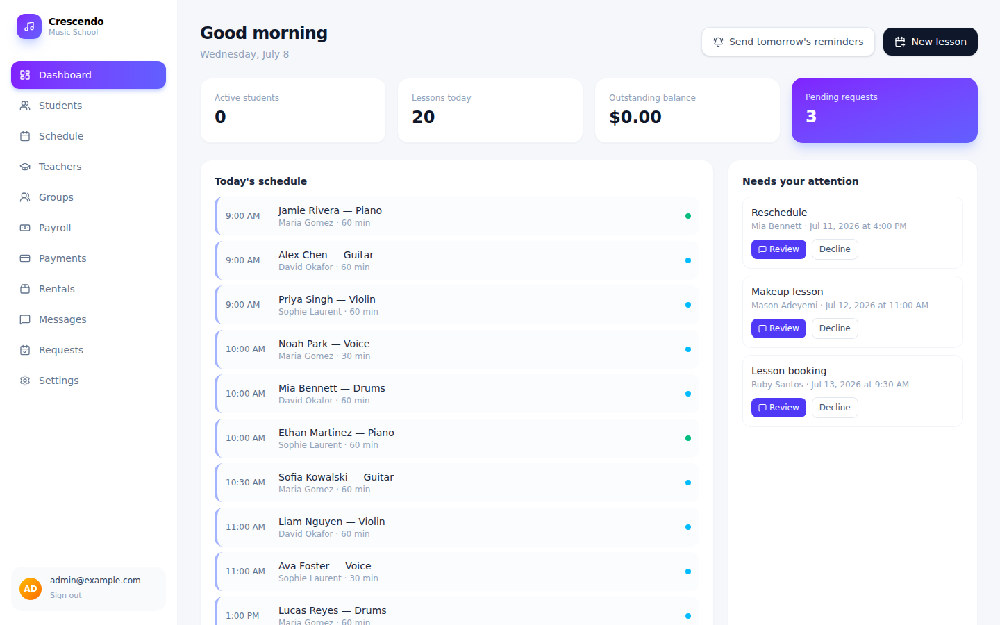
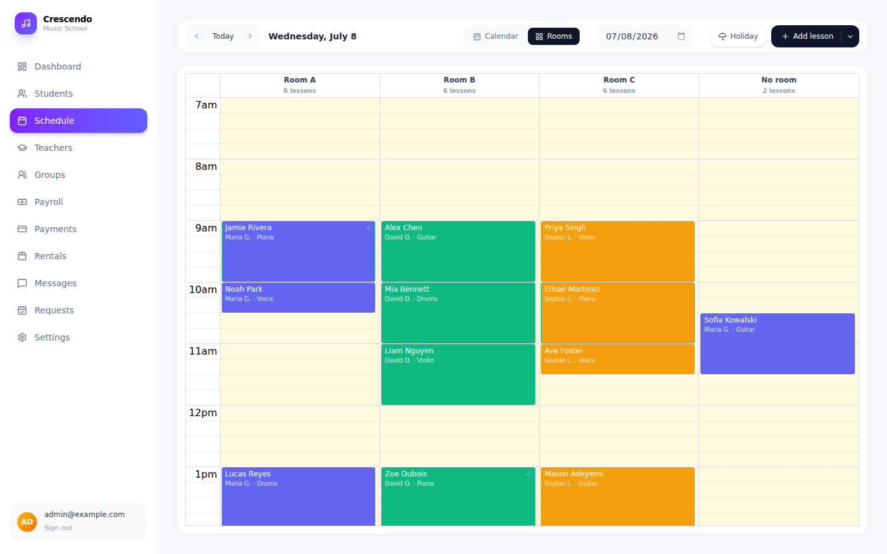
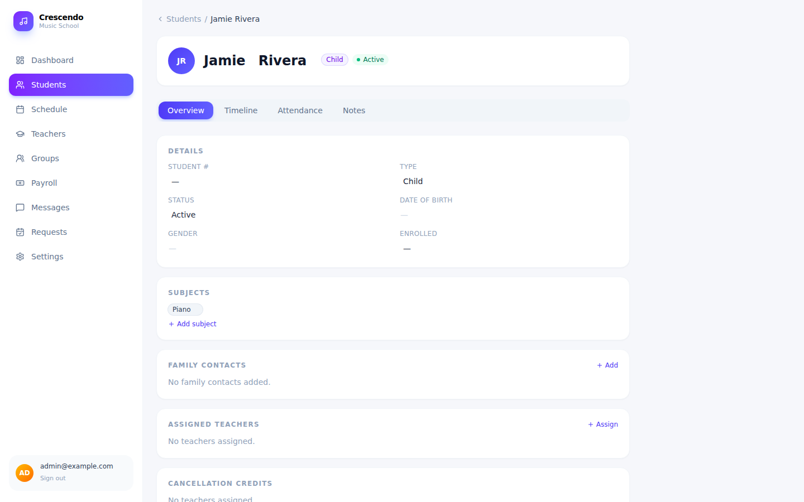
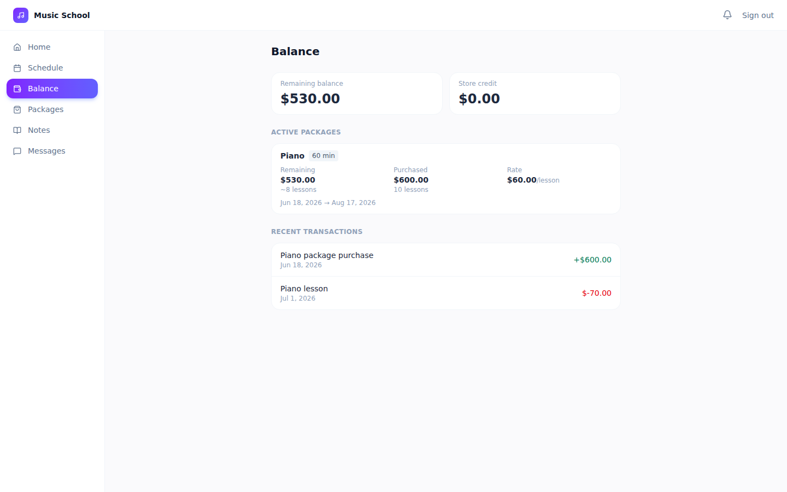

# Music School App

A complete operations system for running a music school — scheduling, billing,
packages, and parent/student/teacher self-service, all in one place.

## The problem

Running a music school usually means juggling a paper calendar, a spreadsheet of who
paid what, a group chat for cancellations, and a notebook for "remember to remind the
Smiths their package is almost up." Lessons get double-booked, packages run out
without anyone noticing, parents text the front desk for things they could just check
themselves, and figuring out what to pay each teacher at the end of the month takes an
afternoon.

This app replaces all of that with one shared system that the school, its teachers,
and its families all use.

## A look inside

| Admin Dashboard | Schedule |
|---|---|
|  |  |
| At-a-glance view of today's lessons, pending requests, and lessons that have drifted past a student's package end date. | One calendar for every lesson, every teacher, every room. |

| Student Profile | Student/Parent Portal |
|---|---|
|  |  |
| Each student's packages, balance, and lesson history in one place. | Parents and students see their own balance and upcoming lessons. |

## What this gives you

- One calendar for every lesson, every teacher, every room — no double-booking.
- A clear answer to "has this student paid?" at any moment.
- Automatic reminders before a student's lesson package runs out, and a dashboard
  that keeps nagging you about it until you actually act on it.
- Parents and students can see their own schedule and balance, and buy their next
  package online, without calling you.
- Students and teachers request changes (new lessons, reschedules, makeups) through
  the app instead of texts and phone calls — you approve or decline from one place.
- Cancellation policy (notice windows, credits, makeups) is enforced automatically
  instead of remembered case by case.
- Teacher pay is calculated for you from the lessons actually taught.

## Who uses it

### Admin (you / the front desk)
Full control: add and manage students and teachers, build the schedule, sell
packages, track balances, review and act on requests, configure pricing and policy,
and run payroll. The Dashboard gives you an at-a-glance view of today's schedule,
anything waiting for your attention, renewal reminders that have gone out but haven't
been acted on, and lessons that have drifted past a student's package end date.

### Teachers
See their own schedule, take attendance (present, absent, cancelled, school holiday)
and add lesson notes, view their own students' contact info and history, set their
weekly availability and block out one-off dates, and message the school or a
student's family.

### Students / parents
See their own upcoming lessons and balance, buy their next lesson package online
(card payment, with an offline option if needed), see their payment history, and
request a new lesson, a reschedule, or a makeup — all from their own login, no
phone call required.

## How it works (the basics)

### How to add a student
From the Students list, add a new student with their contact info, who to reach in
an emergency, and any notes the teachers should know. From there you can optionally
invite the student or a parent to their own portal login.

### What's a "package" and what's a "term"
A **package** is what you sell — e.g. "13 piano lessons, 60 minutes, $910." Once a
student buys one, it becomes a **term**: the active window of time that package
covers, with its own start date, end date, and locked-in per-lesson rate (so a later
price change never retroactively changes what an existing student is paying).

If a student buys their next package before the current one is finished, it shows up
as **queued** — it waits in the background and automatically takes over the moment
the current term ends or runs out of lessons. You can also open a queued package to
see its details, activate it early by hand, or delete it if it was added by mistake.

### How to schedule a lesson
Add a lesson to the calendar with a student, teacher, room, date, and time. Lessons
can repeat weekly automatically, and group sessions (bands, group classes) work the
same way but with multiple students at once.

### How attendance and billing work
When a teacher marks a lesson as **present**, that lesson is automatically charged
against the student's active package at the rate that was locked in when the package
was sold. Marking a lesson **absent**, **teacher-cancelled**, or **school holiday**
applies your cancellation policy automatically instead of charging the student.

### How cancellations and makeups work
You set a notice window (e.g. 24 hours) in Settings. Cancel with enough notice and
nothing is charged; cancel late and the policy you've configured kicks in
automatically — last-minute credits, a free makeup owed by the school if a teacher
cancelled, or a charge if a student didn't give notice. Students can also request a
makeup lesson when one is owed.

### How a parent or student uses their own portal
They log in to see their own schedule and balance, browse and buy their next
package, see a full history of what they've paid, and send a request (new lesson,
reschedule, makeup) instead of calling the office. Every request lands as a message
for the admin to approve or decline.

### How renewal reminders work
As a student's active package gets close to running out, an email reminder goes out
to the family automatically. That reminder also shows up on your Dashboard, so you
know it was sent — and it stays there as a nudge until the student actually renews,
then quietly disappears.

### How teacher pay is calculated
Set each teacher up as either an hourly rate or a percentage of what their lessons
were charged. At the end of the month, payroll totals are calculated from the
lessons actually taught and can be exported.

## Settings you can configure

- Pricing per subject and lesson length, with effective dates so past students keep
  their old rate
- How many lessons/weeks make up a package
- Cancellation notice window and how cancellation credits work
- Rooms / teaching spaces
- Staff accounts and what each role (admin, teacher) is allowed to do
- Turning whole features on or off (packages, store credit, cancellation credits,
  messaging) if your school doesn't use them

## Built with

React, TypeScript, and Tailwind CSS on the frontend; Supabase (database, auth,
backend functions) and Stripe for payments.
